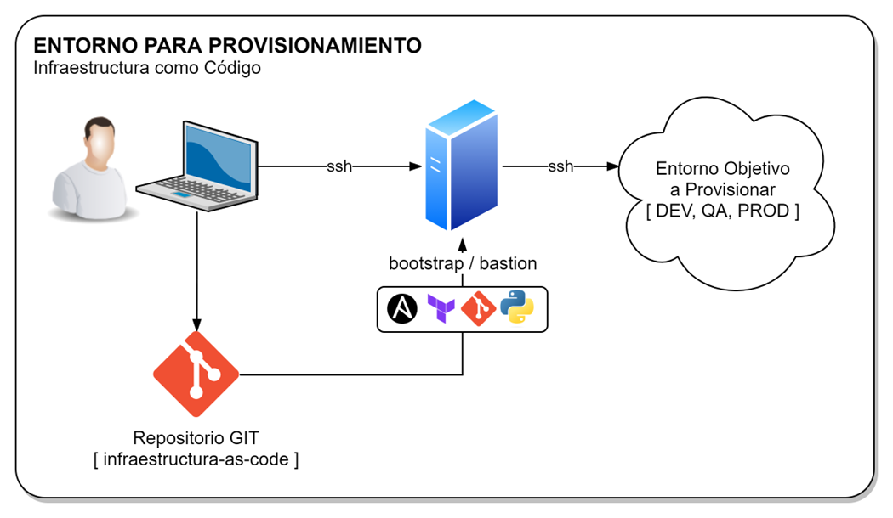
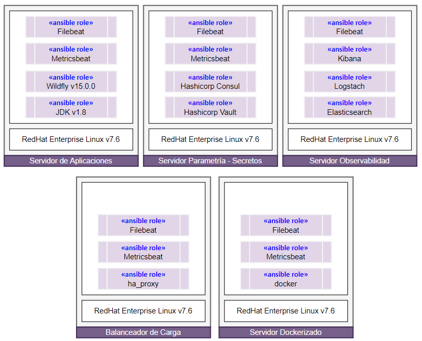

# Provisionamiento de Entornos con IaC (Infrastructure as Code)
Aplicación de Código de Infraestructura

## Preparacion de Entorno


```sh
python3 -m venv /opt/ansible
source /opt/ansible/bin/activate
```
# Provisionamiento de Servidores



## Provisionamiento del Bootstrap / Bastion
```sh
ENTORNO=dev
ansible-playbook -i $ENTORNO 01.install.yaml
```
## Provisionamiento de Balanceador de Carga

```sh
ENTORNO=dev
ansible-playbook -i $ENTORNO 01.balanceador.yaml
```

## Provisionamiento de Servidor de Observabilidad

```sh
ENTORNO=dev
ansible-playbook -i $ENTORNO 02.monitoreo.yaml
```

## Provisionamiento de Servidor Parametria - Secretos

```sh
ENTORNO=dev
ansible-playbook -i $ENTORNO 03.parametria-secretos.yaml
```

## Provisionamiento de Servidor Dockerizado

```sh
ENTORNO=dev
ansible-playbook -i $ENTORNO 03.servidores-dockerizado.yaml
```
